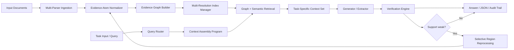
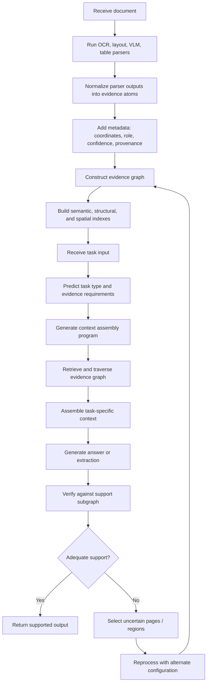
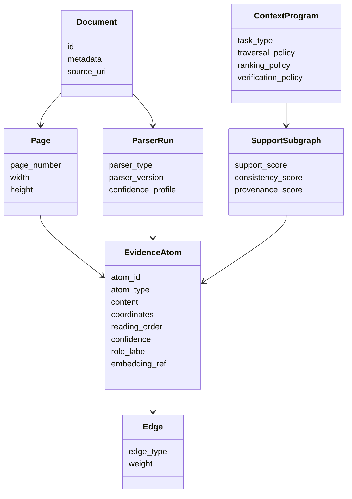

# Patent Package Draft

## Title

Adaptive Evidence Graph Construction, Query-Conditioned Context Assembly, and Verified Output Generation for Multimodal Document Intelligence

## Purpose

This document expands the prior invention memo into a more filing-ready package with:

- provisional-style claim scaffolding
- concrete embodiments
- architecture and process diagrams
- implementation notes for prototype alignment

This is still a technical drafting aid, not legal advice.

## Executive framing

The proposed invention addresses a technical weakness in document intelligence systems that flatten complex documents into static text chunks. The invention instead:

1. parses documents into multimodal evidence atoms
2. links those atoms into an evidence graph
3. dynamically assembles task-specific context from the graph
4. verifies outputs against supporting evidence subgraphs
5. selectively reprocesses uncertain regions instead of reprocessing the whole document

## Provisional-Style Claim Set

The language below is intentionally broad but technical. A patent attorney should refine these into jurisdiction-specific independent and dependent claims.

### Independent claim 1: computer-implemented method

1. A computer-implemented method for document intelligence, the method comprising:
   receiving, by one or more processors, a digital document;
   generating, from the digital document, a plurality of evidence atoms using outputs from a plurality of document-analysis processes, wherein the evidence atoms comprise at least extracted content and associated metadata;
   constructing an evidence graph connecting the plurality of evidence atoms according to one or more structural, spatial, semantic, or reference relationships;
   receiving a task input associated with the digital document;
   determining, based on the task input, a context assembly program defining one or more retrieval or traversal operations over the evidence graph;
   generating a task-specific context set by executing the context assembly program over the evidence graph;
   generating an output based at least in part on the task-specific context set; and
   verifying the output using support constraints associated with at least a subset of the evidence atoms.

### Independent claim 2: selective reprocessing

2. A computer-implemented method comprising:
   detecting, in association with a task input, insufficient support, low confidence, or contradiction among evidence atoms relevant to an output;
   selecting one or more regions of the digital document associated with the relevant evidence atoms;
   reprocessing the selected one or more regions using an alternate document-analysis configuration;
   updating the evidence graph using results of the reprocessing; and
   regenerating or revising the output based on the updated evidence graph.

### Independent claim 3: system claim

3. A document-intelligence system comprising:
   one or more parser interfaces configured to obtain outputs from a plurality of document-analysis engines;
   an evidence atom normalizer configured to convert the outputs into normalized evidence atoms;
   an evidence graph builder configured to connect the normalized evidence atoms using multiple relationship types;
   an index manager configured to maintain multiple indexes over the evidence graph;
   a query router configured to generate a context assembly program for a task input; and
   a verification engine configured to validate an output using a supporting evidence subgraph.

### Independent claim 4: non-transitory computer-readable medium

4. A non-transitory computer-readable medium storing instructions that, when executed by one or more processors, cause the one or more processors to perform the method of any of claims 1-2.

## Dependent Claim Themes

### Evidence atom details

5. The method of claim 1, wherein each evidence atom includes page coordinates.

6. The method of claim 1, wherein each evidence atom includes a reading-order position.

7. The method of claim 1, wherein each evidence atom includes a parser identifier and parser confidence score.

8. The method of claim 1, wherein the evidence atoms include at least two of: text spans, table cells, figure captions, formulas, key-value fields, citations, clauses, or layout zones.

### Relationship construction

9. The method of claim 1, wherein the evidence graph includes containment edges linking sections, paragraphs, and spans.

10. The method of claim 1, wherein the evidence graph includes spatial adjacency edges based on page geometry.

11. The method of claim 1, wherein the evidence graph includes table edges linking rows, columns, and cells.

12. The method of claim 1, wherein the evidence graph includes citation or cross-reference edges linking references across pages or documents.

### Indexing and routing

13. The method of claim 1, wherein the index manager maintains both a semantic index and a structural path index.

14. The method of claim 1, wherein the context assembly program is selected based on a predicted task type.

15. The method of claim 14, wherein the predicted task type includes at least one of factual lookup, comparative reasoning, table extraction, clause extraction, cross-page reasoning, or cross-document reasoning.

16. The method of claim 1, wherein the task-specific context set is generated by combining graph traversal with semantic retrieval.

### Verification

17. The method of claim 1, wherein verifying the output includes determining whether the output is supported by a connected evidence subgraph.

18. The method of claim 17, wherein the connected evidence subgraph is required to satisfy one or more thresholds associated with provenance diversity, parser confidence, structural consistency, or contradiction absence.

19. The method of claim 1, wherein the output is rejected or flagged when the support constraints are not satisfied.

### Reprocessing

20. The method of claim 2, wherein the alternate document-analysis configuration uses a different parser type.

21. The method of claim 2, wherein the alternate document-analysis configuration uses higher-resolution analysis for selected regions.

22. The method of claim 2, wherein only a subset of pages or page regions is reprocessed.

23. The method of claim 2, wherein the updated evidence graph replaces or merges conflicting evidence atoms based on confidence or consistency criteria.

### Multi-document operation

24. The method of claim 1, wherein the evidence graph spans multiple documents.

25. The method of claim 24, wherein the output includes a cross-document answer or extraction linked to evidence atoms from at least two documents.

## Embodiments

### Embodiment A: legal document review

The system ingests a contract and its exhibits, generates evidence atoms for clauses, definitions, schedules, and table entries, and builds edges linking defined terms, references, and liability sections. For a task asking for termination triggers, the query router generates a context assembly program that prioritizes definition nodes, clause nodes containing termination-related language, and cross-references to notice periods. The output includes the extracted clauses and supporting evidence spans.

### Embodiment B: financial and tabular intelligence

The system ingests annual reports and extracts table cells, table headers, notes, and footnotes as distinct evidence atoms. Context assembly for a query concerning revenue by segment includes table-cell selection, header propagation, period matching, and expansion into nearby explanatory note text. If a numeric value conflicts across OCR and table parsers, the system selectively reprocesses the table region.

### Embodiment C: scientific literature mining

The system extracts paragraph spans, formulas, captions, figure references, and citation nodes. For a task asking for experimental results and associated statistical confidence, the system assembles context from results sections, linked tables, and adjacent confidence indicators. The output is accepted only if the answer is supported by a connected subgraph joining the textual claim to the associated table or figure evidence.

### Embodiment D: patent and prior-art analysis

The system ingests a target patent application and a corpus of prior-art references. Evidence atoms include claims, embodiments, figure references, citations, and technical features. The system supports novelty analysis by linking semantically similar and structurally corresponding evidence across documents while preserving provenance to each source document and region.

## Architecture Figure

## Process Flow Figure

## Data Model Figure

## Example Implementation Notes

The invention can be implemented using a heterogeneous parsing stack and does not require a single model family. A practical implementation can combine:

- OCR and layout analysis for broad coverage
- VLM parsing for reading order and rich visual elements
- specialized table extraction for numeric fidelity
- embedding models for semantic routing
- graph storage for evidence relationships

The inventive core is in the normalized evidence representation, routing logic, verification loop, and selective reprocessing policy.

## Evidence Needed For Filing Strength

To strengthen a provisional filing, gather:

- prototype screenshots or logs
- benchmark comparisons against fixed chunk retrieval
- example outputs with evidence traces
- examples of selective reprocessing reducing error or cost
- schema diagrams for evidence atoms and support subgraphs

## Attorney Handoff Notes

When handing this to counsel, ask them to preserve breadth around:

- graph-based evidence representation
- task-conditioned context programs
- provenance-aware verification
- selective regional reprocessing

At the same time, ask them to avoid overcommitting the claims to one parser type, one embedding model, or one document domain.
